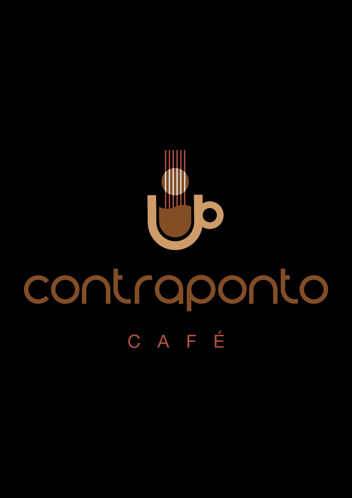

# ☕ Contraponto Café — Sistema de Cashback

Programa de Cashback do Contraponto Café, desenvolvido para rodar no GitHub Pages (gratuito, sem servidor).

---

## 📁 Estrutura dos arquivos

```
contraponto/
├── index.html      ← Página inicial (escolha entre cliente ou lojista)
├── cliente.html    ← Painel do cliente (cadastro, escaneio de cupom, saldo)
├── lojista.html    ← Painel do lojista (dashboard, clientes, resgates)
└── db.js           ← Banco de dados local (funciona no navegador)
```

---

## 🚀 Como publicar no GitHub Pages (passo a passo)

### Passo 1 — Criar conta no GitHub
1. Acesse [github.com](https://github.com) e clique em **Sign up**
2. Crie sua conta gratuitamente

### Passo 2 — Criar um repositório
1. Depois de entrar, clique no botão **"New"** (ou no **"+"** no canto superior direito → New repository)
2. Em **Repository name**, coloque: `contraponto-cashback`
3. Deixe como **Public**
4. Clique em **"Create repository"**

### Passo 3 — Fazer upload dos arquivos
1. Na página do repositório, clique em **"uploading an existing file"**
2. Arraste os 4 arquivos: `index.html`, `cliente.html`, `lojista.html`, `db.js`
3. Clique em **"Commit changes"**

### Passo 4 — Ativar o GitHub Pages
1. No repositório, clique em **Settings** (engrenagem)
2. No menu lateral esquerdo, clique em **Pages**
3. Em **Branch**, selecione `main` e clique em **Save**
4. Aguarde 1-2 minutos

### Passo 5 — Acessar o site
- Seu site estará disponível em:
  `https://SEU-USUARIO.github.io/contraponto-cashback/`
- Esse é o link que você compartilha com os clientes!

---

## 🔐 Senha do painel do lojista

Senha padrão: **`contraponto2024`**

Para alterar a senha, abra o arquivo `lojista.html` e localize a linha:
```javascript
const ADMIN_PASSWORD = 'contraponto2024';
```
Troque `contraponto2024` pela senha que preferir e salve o arquivo.

---

## 🖼️ Como adicionar a logomarca

No `index.html`, `cliente.html` e `lojista.html`, você verá caixas assim:
```html
<div class="logo-placeholder">logo</div>
```
Para adicionar a logo:
1. Faça upload da imagem da logo no repositório (ex: `logo.png`)
2. Substitua o `<div class="logo-placeholder">logo</div>` por:
```html

```

---

## 📱 Como os clientes usam

1. O cliente acessa o link do site no celular
2. Clica em **"Meu Cashback"**
3. Faz o cadastro com nome, CPF e celular
4. Recebe **R$ 15,00** de bônus imediato
5. Após cada compra, escaneia o QR Code do cupom fiscal
6. O sistema extrai o valor automaticamente e credita **5% de cashback**
7. Com R$ 20,00 acumulados, o cliente solicita o resgate no caixa

## 💻 Como você (lojista) usa

1. Acesse o link e clique em **"Painel do Lojista"**
2. Digite a senha de acesso
3. Veja o **dashboard em tempo real** com todos os clientes e transações
4. Para processar um resgate: vá em **"Resgatar"**, busque o CPF do cliente e aplique o desconto

---

## ⚠️ Importante sobre os dados

Os dados ficam salvos **no navegador** de cada dispositivo (localStorage).
- Funciona perfeitamente para começar sem custo nenhum
- Se quiser centralizar os dados (todos os clientes num só lugar), será necessário evoluir para um banco de dados na nuvem no futuro (Firebase, Supabase, etc.)
- **Recomendação:** Use sempre o mesmo computador/tablet no caixa para o painel do lojista

---

## 💡 Dicas de uso

- **Indique o link** para o cliente escanear um QR Code na mesa/balcão que aponte para `cliente.html`
- O **anti-fraude** já está ativo: cada cupom fiscal só pode ser escaneado uma vez
- **Créditos vencem em 90 dias** automaticamente
- O **resgate mínimo é R$ 20,00** — tudo controlado pelo painel do lojista
